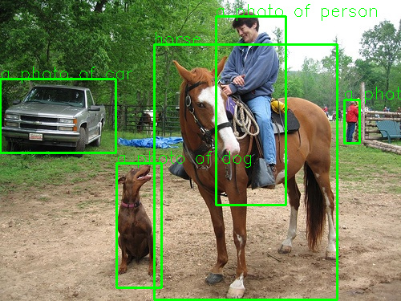

# OWLVIT

https://huggingface.co/docs/transformers/model_doc/owlvit

https://github.com/AXERA-TECH/OWLVIT-ONNX-AX650-CPP/assets/46700201/039fb857-e198-403e-8a3e-54fb3eaad80c

 

## Build
```
mkdir build
cd build
```
if x86 onnxruntime
```
cmake -DONNXRUNTIME_DIR=${onnxruntime_dir} -DOpenCV_DIR=${opencv_cmake_file_dir} ..
```
else if ax650
```
cmake -DONNXRUNTIME_DIR=${onnxruntime_dir} -DOpenCV_DIR=${opencv_cmake_file_dir} -DBSP_MSP_DIR=${msp_out_dir} -DBUILD_WITH_AX650=ON -DCMAKE_TOOLCHAIN_FILE=../toolchains/aarch64-none-linux-gnu.toolchain.cmake ..
```
```
make -j4
```
aarch64-none-gnu library:\
[onnxruntime](https://github.com/ZHEQIUSHUI/SAM-ONNX-AX650-CPP/releases/download/ax_models/onnxruntime-aarch64-none-gnu-1.16.0.zip)\
[opencv](https://github.com/ZHEQIUSHUI/SAM-ONNX-AX650-CPP/releases/download/ax_models/libopencv-4.6-aarch64-none.zip)

### run
```
/opt/test/owlvit # ./main --ienc owlvit-image.axmodel --tenc owlvit-text.onnx -d
 owlvit-post.onnx -v vocab.txt -i ssd_horse.jpg -t text.txt --thread 8
Engine creating handle is done.
Engine creating context is done.
Engine get io info is done.
Engine alloc io is done.
[I][                            init][ 280]: BGR MODEL
[I][              load_image_encoder][  17]: input size 768 768
[I][              load_image_encoder][  29]: image feature len 442368
[I][              load_image_encoder][  32]: pred box cnt  576
[I][               load_text_encoder][ 152]: text feature len 512
[I][                            main][ 120]: image_src [ssd_horse.jpg]
[I][                            main][ 121]: text_src [text.txt]
encode text Inference Cost time : 0.190662s
post Inference Cost time : 0.0550382s
a photo of person 268.899292 20.153463 88.163696 235.837906
a photo of person 428.696014 123.745819 19.836823 55.102310
horse 191.756058 55.418949 229.225601 318.581055
a photo of car 0.000000 98.398750 145.470108 92.571877
a photo of dog 145.470108 203.093140 57.306412 156.490570

```
